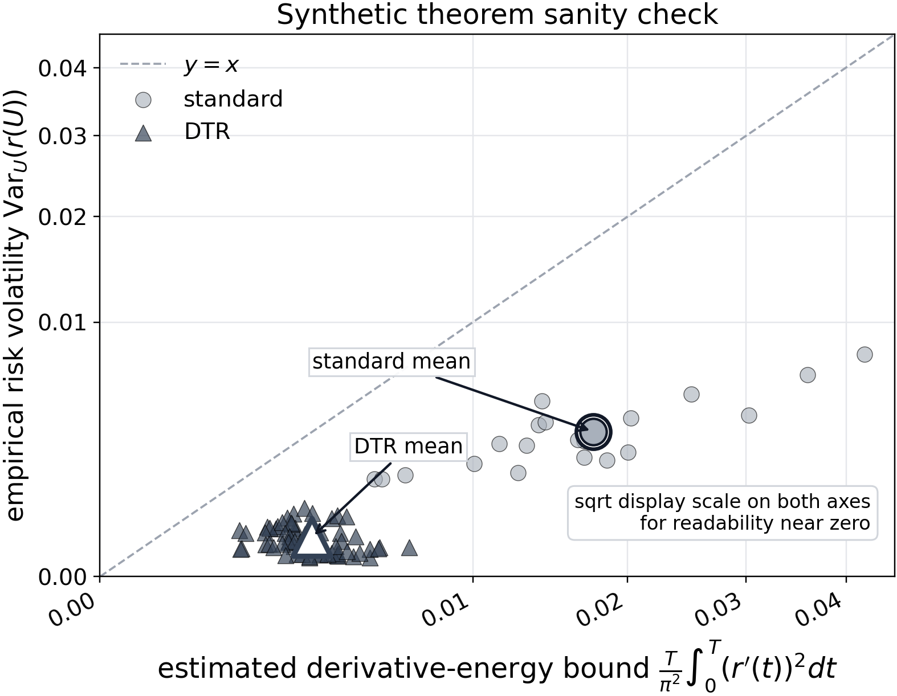
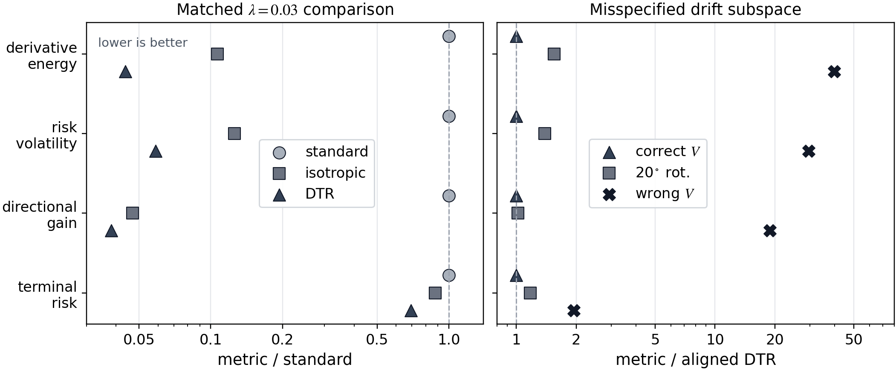
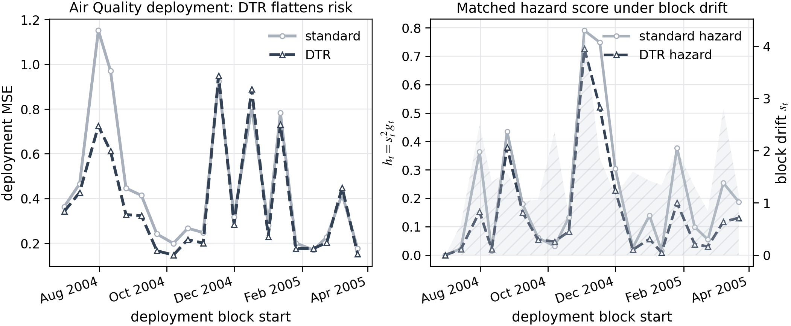

# Jacobian-Velocity Bounds for Deployment Risk Under Covariate Drift

Professional package for the manuscript, experiments, and figures accompanying:

**[Repository home](https://github.com/jonland82/jacobian-velocity-bounds)**

**[View the live project site](https://jonland82.github.io/jacobian-velocity-bounds/)**

**[Read the manuscript (PDF)](./jacobian_velocity_bounds_deployment_risk_covariate_drift.pdf)**

**[Open the proof verification report](./proof_verification/verification_report.html)**

This repository studies a frozen predictor deployed under dynamic covariate drift. The central claim is that long-horizon deployment instability is governed not just by how much the environment moves, but by how that motion aligns with the model's local tangent geometry. The dangerous quantity is the Jacobian-velocity interaction

$$ J_f(X_t)\dot X_t. $$

That geometric view yields:

- a time-domain bound on deployment-risk volatility,
- a low-rank drift specialization,
- a drift-aligned tangent regularizer (DTR),
- a matched monitoring score for deployment,
- and a proof-verification suite that checks the theorem chain symbolically and numerically.

An expanded project page for GitHub Pages lives at [`index.html`](./index.html).

## Overview

Let $X_t \in \mathbb{R}^d$ denote the deployment covariate path, let $f_\theta$ be a frozen predictor, and let

$$ r(t) := \mathbb{E}[g_\theta(X_t)] $$

be the deployment-risk trajectory induced by a performance field $g_\theta$.

The paper's main theorem package formalizes the intuition that risk becomes volatile when the data stream repeatedly travels through directions where the predictor is locally steep.

## Main Mathematical Results

### 1. Time-domain derivative-energy control

If $r$ is absolutely continuous on $[0,T]$, then

$$ \mathrm{Var}_U(r(U)) \le \frac{T}{\pi^2}\int_0^T (r'(t))^2\,dt, $$

where $U \sim \mathrm{Unif}[0,T]$.

This is the temporal Poincare/Wirtinger step: deployment volatility cannot be large without derivative energy.

### 2. Jacobian-velocity bound

Under the paper's regularity assumptions A1-A3,

$$ \mathrm{Var}_U(r(U)) \le \frac{\beta^2 T}{\pi^2}\int_0^T \mathbb{E}\!\left[\|J_f(X_t)\dot X_t\|^2\right]dt. $$

This identifies the geometric driver of instability: accumulated tangent amplification of the deployment path.

### 3. Low-rank drift specialization

If the deployment velocity decomposes as

$$ \dot X_t = Va_t + \rho_t, \qquad V^\top V = I_k, $$

then the leading term is governed by directional Jacobian energy inside the drift subspace:

$$ \mathcal{L}_{\mathrm{DTR}}(\theta) = \mathbb{E}_{(X,Y)}[\ell(f_\theta(X),Y)] + \lambda \mathbb{E}_X\|J_f(X)V\|_F^2. $$

The same geometry yields the monitoring score

$$ h_t = s_t^2 g_t, \qquad s_t := \|\Delta \mu_t\|/\Delta, \qquad g_t := \mathbb{E}\|J_f(X_t)V_t\|_F^2. $$

## Proof Verification Suite

The repository also includes a dedicated verification package in [`proof_verification/`](./proof_verification/) that checks the paper's main mathematics independently of the prose presentation and experiment plots.

The verifier covers:

- exact symbolic checks for the Poincare/Wirtinger step, a deterministic equality case for the Jacobian-velocity theorem, the composition case behind A3, and the Bernoulli cross-entropy derivative bound;
- numerical stress tests for the low-rank corollary inequalities and for the full inequality chain in a smooth expectation-based example;
- artifact checks against the cached synthetic CSV summaries already committed under [`figures/`](./figures/).

Running the verifier generates:

- [`proof_verification/verification_report.html`](./proof_verification/verification_report.html), an HTML report that reuses the same styling as [`index.html`](./index.html);
- [`proof_verification/verification_results.json`](./proof_verification/verification_results.json), a machine-readable dump of the check results.

## Experimental Results

The repository contains three experiments mirroring the theorem-to-method pipeline.

### Synthetic time-domain sanity check

This experiment verifies the time-domain inequality in the smallest controlled setting with one stable signal coordinate and one drifting nuisance coordinate.

- Standard mean risk volatility: $3.13 \times 10^{-3}$
- DTR mean risk volatility: $2.62 \times 10^{-4}$
- Relative volatility reduction: **91.6%**
- Standard mean directional gain: $44.9$
- DTR mean directional gain: $1.91$
- Relative directional-gain reduction: **95.8%**

Figure:



### Directional vs isotropic Jacobian smoothing

Under rank-1 drift, the right empirical question is not whether Jacobian regularization helps in general, but whether drift-aligned smoothing beats isotropic smoothing.

At the matched $\lambda = 0.03$ comparison:

- Standard volatility: $3.13 \times 10^{-3}$
- Isotropic volatility: $4.17 \times 10^{-4}$
- DTR volatility: $2.12 \times 10^{-4}$
- Standard terminal risk: $0.171$
- Isotropic terminal risk: $0.161$
- DTR terminal risk: $0.127$

The misspecification study shows the expected directional behavior:

- A $20^\circ$ rotation raises volatility by a factor of **1.43** relative to aligned DTR.
- A wrong orthogonal subspace raises volatility by a factor of **23.9**.

Figure:



### Field deployment on UCI Air Quality

The real-data study freezes a regressor after training, estimates a 2D drift subspace from unlabeled deployment covariates, and evaluates blockwise deployment MSE over 20 biweekly blocks.

- Training / validation / deployment rows: `1573 / 580 / 5191`
- Deployment blocks: `20`
- Selected DTR setting: $\lambda = 0.03$
- Standard mean volatility: $9.29 \times 10^{-2}$
- Selected DTR mean volatility: $6.49 \times 10^{-2}$
- Relative volatility reduction: **30.2%**
- Standard mean directional gain: $8.65 \times 10^{-2}$
- Selected DTR mean directional gain: $6.09 \times 10^{-2}$
- Relative directional-gain reduction: **29.5%**
- Standard mean terminal risk: $0.169$
- Selected DTR mean terminal risk: $0.149$

For the representative seed shown in the figure, the standard regressor peaks at deployment MSE `1.152`, while the DTR regressor peaks at `0.949`.

Figure:



## Repository Layout

```text
.
|-- index.html
|-- LICENSE
|-- README.md
|-- requirements.txt
|-- jacobian_velocity_bounds_deployment_risk_covariate_drift.tex
|-- jacobian_velocity_bounds_deployment_risk_covariate_drift.pdf
|-- proof_verification/
|   |-- generate_report.py
|   |-- checks.py
|   |-- report.py
|   |-- verification_report.html
|   `-- verification_results.json
|-- references.bib
|-- data/
|   `-- air_quality.csv
|-- figures/
|   |-- figure_1_geometry.png
|   |-- figure_2_synthetic_theorem.png
|   |-- figure_3_air_quality_monitoring.png
|   |-- figure_4_directional_ablation.png
|   |-- synthetic_theorem_summary.json
|   |-- synthetic_directional_summary.json
|   `-- air_quality_summary.json
`-- scripts/
    |-- generate_all_figures.py
    |-- run_synthetic_theorem_experiment.py
    |-- run_synthetic_directional_ablation.py
    |-- run_air_quality_experiment.py
    |-- plot_figure_1_geometry.py
    |-- plot_figure_2_synthetic_theorem.py
    |-- plot_figure_3_air_quality_monitoring.py
    `-- plot_figure_4_directional_ablation.py
```

## Reproduction

Create an environment and install the Python dependencies:

```powershell
python -m venv .venv
.venv\Scripts\Activate.ps1
pip install -r requirements.txt
```

Regenerate all experiment summaries and manuscript figures:

```powershell
python scripts/generate_all_figures.py
```

Generate the proof verification report:

```powershell
python proof_verification/generate_report.py
```

Build the manuscript:

```powershell
latexmk -pdf jacobian_velocity_bounds_deployment_risk_covariate_drift.tex
```

Notes:

- The Air Quality experiment caches the UCI dataset to [`data/air_quality.csv`](./data/air_quality.csv).
- The scripts are CPU-oriented and use PyTorch for the training loops.
- The `figures/*.json` and `figures/*.csv` files are cached summaries consumed by the plotting scripts.
- The proof verifier adds `sympy` on top of the experiment dependencies and emits both HTML and JSON outputs under [`proof_verification/`](./proof_verification/).

## Citation

If you use this repository, cite the manuscript:

```bibtex
@article{landers2026jacobianvelocity,
  title   = {Jacobian-Velocity Bounds for Deployment Risk Under Covariate Drift},
  author  = {Landers, Jonathan R.},
  year    = {2026},
  note    = {Manuscript},
  url     = {./jacobian_velocity_bounds_deployment_risk_covariate_drift.pdf}
}
```

## License

This repository is released under the [MIT License](./LICENSE).
