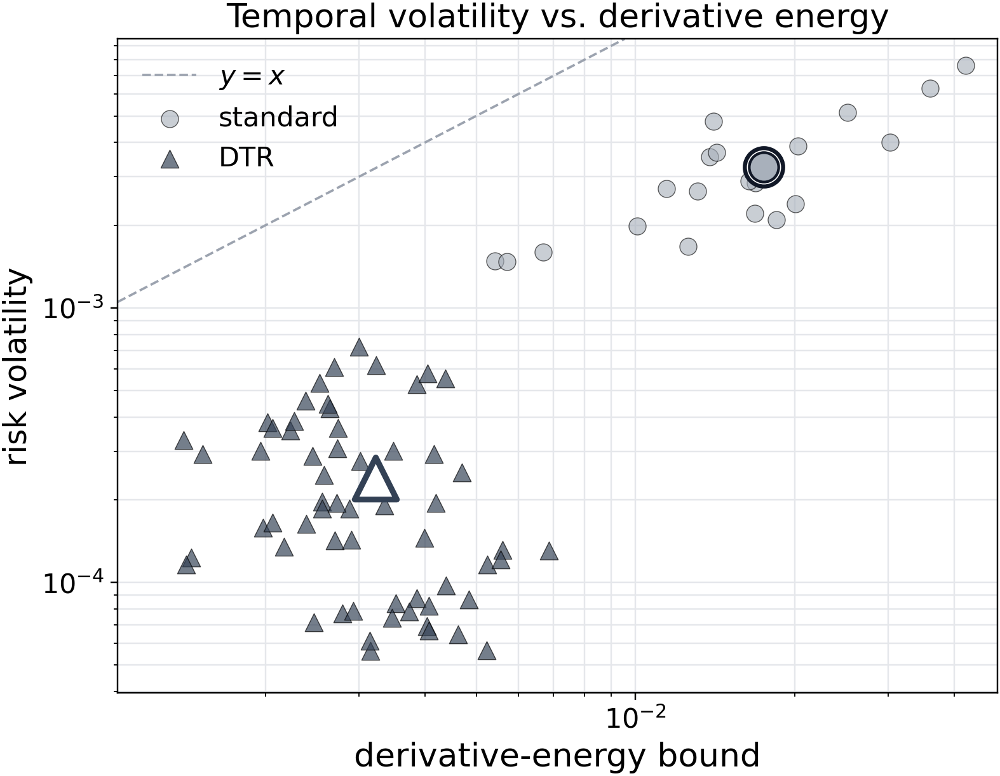
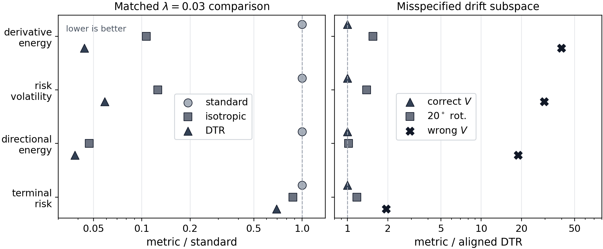
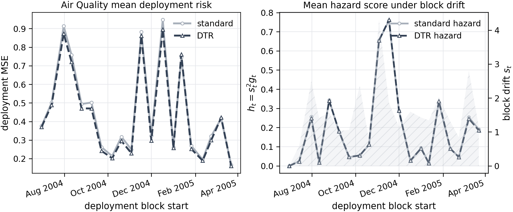
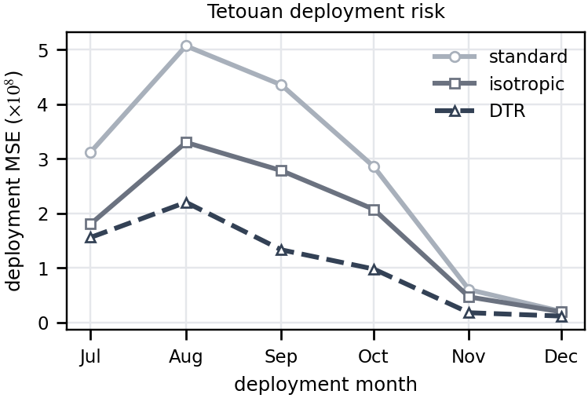
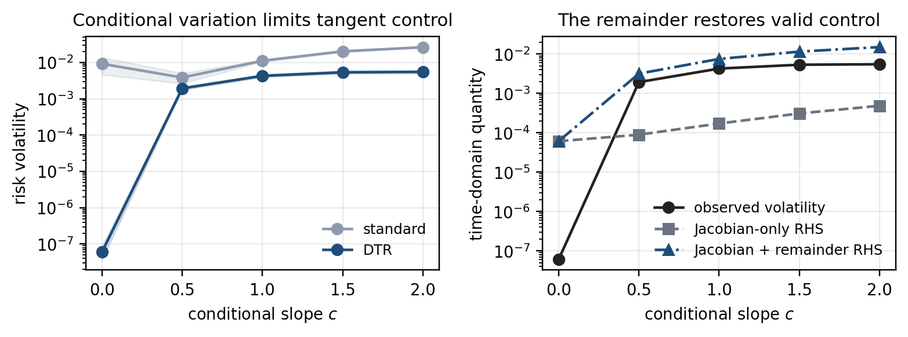

# Jacobian-Velocity Bounds for Deployment Risk Under Covariate Drift

Professional package for the manuscript, experiments, and figures accompanying:

**[Repository home](https://github.com/jonland82/jacobian-velocity-bounds)**

**[View the live project site](https://jonland82.github.io/jacobian-velocity-bounds/)**

**[Read the arXiv paper](https://arxiv.org/abs/2605.04932)**

**[Read the manuscript (PDF)](./jacobian_velocity_bounds_deployment_risk_covariate_drift.pdf)**

**[Open the proof verification report](./proof_verification/verification_report.html)**

This repository studies a frozen predictor deployed under dynamic covariate drift. The central claim is that long-horizon deployment instability is governed not just by how much the environment moves, but by how that motion aligns with the model's local tangent geometry. The dangerous quantity is the Jacobian-velocity interaction

$$ J_f(X_t)\dot X_t. $$

That geometric view yields:

- a time-domain bound on deployment-risk volatility,
- a remainder extension separating model-mediated sensitivity from conditional-risk variation outside the score geometry,
- a low-rank drift specialization,
- an anisotropic drift-aligned tangent regularization family spanning pure DTR, guarded hybrids, and isotropic smoothing,
- a matched monitoring score together with a rank-1 bookkeeping proposition,
- a central gas-sensor deployment study with a strict predeployment rank-4 basis and ten matched random-subspace controls,
- complementary Air Quality and Tetouan regression studies, prospective-subspace tests, an Air Quality subspace ablation, and a monitoring-volatility ablation,
- and a proof-verification suite that checks the theorem chain and monitoring bookkeeping symbolically and numerically.

An expanded project page for GitHub Pages lives at [`index.html`](./index.html).

## Overview

Let $X_t \in \mathbb{R}^d$ denote the deployment covariate path, let $f_\theta$ be a frozen predictor, and let

$$ r(t) := \mathbb{E}[g_\theta(X_t)] $$

be the deployment-risk trajectory induced by a performance field $g_\theta$.

The paper's main theorem package formalizes the intuition that risk becomes volatile when the data stream repeatedly travels through directions where the predictor is locally steep.

## Main Mathematical Results

### 1. Time-domain derivative-energy control

If $r$ is absolutely continuous on $[0,T]$, then

$$ \mathrm{Var}_U(r(U)) \le \frac{T}{\pi^2}\int_0^T (r'(t))^2\,dt, $$

where $U \sim \mathrm{Unif}[0,T]$.

This is the temporal Poincar&eacute;/Wirtinger step: deployment volatility cannot be large without derivative energy.

### 2. Jacobian-velocity bound

Under the paper's regularity assumptions A1-A3,

$$ \mathrm{Var}_U(r(U)) \le \frac{\beta^2 T}{\pi^2}\int_0^T \mathbb{E}\!\left[\|J_f(X_t)\dot X_t\|^2\right]dt. $$

This identifies the geometric driver of instability: accumulated tangent amplification of the deployment path.

### 3. Conditional-risk remainder

When covariate shift moves through a spatially varying label conditional, Proposition 1 retains the resulting non-Jacobian contribution as $q_t$:

$$ \mathrm{Var}_U(r(U)) \le \frac{T}{\pi^2}\int_0^T \mathbb{E}\!\left[(\beta\|J_f(X_t)\dot X_t\|+q_t)^2\right]dt. $$

This distinguishes what DTR can control through the frozen predictor from conditional-risk variation requiring a richer model, labels, or adaptation.

### 4. Low-rank drift specialization

If the deployment velocity decomposes as

$$ \dot X_t = Va_t + \rho_t, \qquad V^\top V = I_k, $$

then the controllable term separates into Jacobian energy parallel and orthogonal to the drift subspace. The corresponding anisotropic objective is

$$
\begin{aligned}
\mathcal{L}_{\mathrm{A\text{-}DTR}}(\theta)
&= \mathbb{E}_{(X,Y)}[\ell(f_\theta(X),Y)] \\
&\quad + \lambda_\parallel \mathbb{E}_X\|J_f(X)V\|_F^2
+ \lambda_\perp \mathbb{E}_X\|J_f(X)P_V^\perp\|_F^2,
\qquad 0\leq\lambda_\perp\leq\lambda_\parallel.
\end{aligned}
$$

Here $P_V=VV^\top$ and $P_V^\perp=I-P_V$. This family contains standard training when both weights vanish, pure DTR when $\lambda_\perp=0$, and isotropic Jacobian smoothing when $\lambda_\perp=\lambda_\parallel$. Interior settings retain stronger control along expected drift while adding a weaker orthogonal guardrail for residual motion or subspace error.

The same geometry yields the monitoring score

$$ h_t = s_t^2 g_t, \qquad s_t := \|\Delta \mu_t\|/\Delta, \qquad g_t := \mathbb{E}\|J_f(X_t)V_t\|_F^2. $$

The real-data monitoring ablation evaluates this score, plus short rolling averages of it, against block-to-block squared risk movement rather than raw risk level.

### 5. Rank-1 hazard-score bookkeeping

In the rank-1 monitoring setting, the proxy gap is explicit. If

$$ \frac{\Delta \mu_t}{\Delta} = v \bar a_t + \bar \rho_t, \qquad v^\top \bar \rho_t = 0, \qquad v_t = \cos\theta_t\,v + \sin\theta_t\,u_t, $$

then

$$ s_t^2 = |\bar a_t|^2 + \|\bar \rho_t\|^2, $$

and

$$ g_t = \cos^2\theta_t\,G_{\parallel,t} + \sin^2\theta_t\,G_{\perp,t} + 2\sin\theta_t\cos\theta_t\,C_t. $$

This bookkeeping statement shows how block averaging, residual drift, and angular misalignment determine how \(h_t\) departs from the leading low-rank term.

## Proof Verification Suite

The repository also includes a dedicated verification package in [`proof_verification/`](./proof_verification/) that checks the paper's main mathematics, including the hazard-score bookkeeping proposition, independently of the prose presentation and experiment plots.

The verifier covers:

- exact symbolic checks for the Poincar&eacute;/Wirtinger step, a deterministic equality case for the Jacobian-velocity theorem, the composition case behind A3, the rank-1 hazard-score bookkeeping identity, and the Bernoulli cross-entropy derivative bound;
- numerical stress tests for the low-rank corollary inequalities and for the full inequality chain in a smooth expectation-based example;
- artifact checks against the cached synthetic CSV summaries under [`figures/`](./figures/).

Running the verifier generates:

- [`proof_verification/verification_report.html`](./proof_verification/verification_report.html), an HTML report that reuses the same styling as [`index.html`](./index.html);
- [`proof_verification/verification_results.json`](./proof_verification/verification_results.json), a machine-readable dump of the check results.

## Experimental Results

The repository contains controlled and field experiments mirroring the theorem-to-method pipeline, including direct tests of the conditional-risk remainder bound and prospective subspace estimation.

### Synthetic time-domain sanity check

This experiment verifies the time-domain inequality in the smallest controlled setting with one stable signal coordinate and one drifting nuisance coordinate.

- Standard mean risk volatility: $3.25 \times 10^{-3}$
- DTR mean risk volatility: $2.39 \times 10^{-4}$
- Relative volatility reduction: **92.6%**
- Standard mean directional energy: $41.5$
- DTR mean directional energy: $1.85$
- Relative directional-energy reduction: **95.5%**
- Seeds: `20`

Figure:



### Directional vs isotropic Jacobian smoothing

Under rank-1 drift, the right empirical question is not whether Jacobian regularization helps in general, but whether drift-aligned smoothing beats isotropic smoothing.

At the matched $\lambda = 0.03$ comparison:

- Standard volatility: $3.25 \times 10^{-3}$
- Isotropic volatility: $4.09 \times 10^{-4}$
- DTR volatility: $1.91 \times 10^{-4}$
- Standard terminal risk: $0.189$
- Isotropic terminal risk: $0.165$
- DTR terminal risk: $0.131$

The misspecification study shows the expected directional behavior:

- A $20^\circ$ rotation raises volatility by a factor of **1.39** relative to aligned DTR.
- A wrong orthogonal subspace raises volatility by a factor of **29.6**.
- Seeds: `20`

Figure:



### Main field study: UCI gas-sensor drift

The central field experiment uses the UCI Gas Sensor Array Drift at Different Concentrations dataset: 128 features from 16 metal-oxide sensors collected over ten chronological batches. A five-gas classifier trains on batches 1–2, validates on batches 3–5, and is frozen for deployment on batches 6–10. The drift basis is estimated entirely before deployment by removing gas- and concentration-dependent calibration response and taking the singular vectors of the remaining batch-mean motion. Validation selects rank 4, only four directions in the 128-dimensional input.

The anisotropic sweep compares standard training, pure DTR, isotropic smoothing, and two validation-defined interior settings:

| Method $(\lambda_\perp,\lambda_\parallel)$ | Deploy CE | Volatility | Terminal CE | Macro accuracy |
| --- | ---: | ---: | ---: | ---: |
| Standard $(0,0)$ | $2.151\pm0.229$ | $0.646\pm0.183$ | $3.010\pm0.363$ | $0.576\pm0.048$ |
| Pure DTR $(0,1)$ | $1.244\pm0.181$ | $0.340\pm0.096$ | $1.950\pm0.264$ | **$0.680\pm0.013$** |
| Isotropic $(1,1)$ | $1.267\pm0.071$ | **$0.021\pm0.004$** | $1.139\pm0.053$ | $0.503\pm0.041$ |
| Hybrid, CE rule $(0.003,3)$ | $0.987\pm0.115$ | $0.179\pm0.043$ | $1.493\pm0.166$ | $0.660\pm0.017$ |
| Hybrid, stability rule $(0.3,10)$ | **$0.968\pm0.056$** | $0.043\pm0.002$ | **$1.085\pm0.068$** | $0.600\pm0.038$ |

The CE-rule hybrid improves deployment CE, volatility, and terminal CE over pure DTR in all `10 / 10` matched seeds. The stability-rule hybrid reduces CE by `0.299` and improves macro accuracy by `0.098` relative to isotropic smoothing, with only a `0.022` increase in volatility. Pure DTR retains the highest average accuracy, isotropic smoothing minimizes volatility, and the anisotropic hybrids provide the strongest joint risk--stability tradeoff.

Two controls test whether this is merely generic low-rank smoothing. The selected rank-4 predeployment basis beats each of ten ambient-random rank-4 bases on deployment CE, volatility, terminal CE, and macro accuracy. The validation-selected mean deployment CE also improves progressively from rank 1 through rank 4: `2.158`, `1.452`, `1.330`, and `1.244`.

The gas-sensor scripts and cached outputs live under [`benchmark_package/gas_sensor_array_drift/`](./benchmark_package/gas_sensor_array_drift/), with runners and analysis scripts in [`benchmark_package/scripts/`](./benchmark_package/scripts/).

### Complementary regression study: UCI Air Quality

The real-data study freezes a regressor after training and evaluates blockwise deployment MSE over 20 biweekly blocks. Hyperparameters are selected on training/validation windows only, and deployment metrics are reported after selection over matched seeds. The primary DTR run estimates a 2D target-orthogonal sensor-drift subspace: the supervised linear target direction is removed from the five sensor channels using training data, then the drift basis is estimated from unlabeled deployment covariate motion in the remaining sensor space.

- Training / validation / deployment rows: `1573 / 580 / 5191`
- Deployment blocks: `20`
- Seeds: `10`
- Validation-selected isotropic setting: $\lambda = 0.08$
- Validation-selected DTR setting: $\lambda = 0.003$
- Standard deploy MSE: $0.449 \pm 0.069$
- Isotropic deploy MSE: $0.415 \pm 0.030$
- DTR deploy MSE: $0.432 \pm 0.058$
- Standard volatility: $0.073 \pm 0.023$
- Isotropic volatility: $0.077 \pm 0.008$
- DTR volatility: $0.069 \pm 0.020$
- Standard directional energy: $0.079 \pm 0.008$
- DTR directional energy: $0.079 \pm 0.008$
- Paired DTR-vs-standard deploy-MSE wins: `9 / 10`
- Paired DTR-vs-standard volatility wins: `9 / 10`

The subspace ablation shows why this choice matters. An all-covariate drift subspace selects DTR `lambda = 0.08` and over-regularizes deployment risk (`0.485 +/- 0.077` MSE, `0.112 +/- 0.031` volatility). The target-orthogonal sensor subspace selects `lambda = 0.003` and improves MSE and volatility in `9 / 10` paired seeds against standard training. A weather-residualized sensor subspace at `lambda = 0.03` gives the strongest Air Quality mean point (`0.411 +/- 0.050` MSE, `0.061 +/- 0.010` volatility), but it is kept as a sensitivity result rather than the primary validation-selected setting.

In the mean selected trajectory shown in the figure, standard training peaks at deployment MSE `0.947`, while validation-MSE-selected DTR peaks at `0.896`.

Figure:



### Complementary regression study: UCI Tetouan City power consumption

This frozen-deployment benchmark predicts `Zone 1 Power Consumption` from weather and diffuse-flow covariates, trains on January-April 2017, validates on May-June, and deploys on July-December over 6 monthly blocks.

- Training / validation / deployment rows: `17280 / 8784 / 26352`
- Deployment blocks: `6`
- Seeds: `10`
- Validation-selected isotropic setting: $\lambda = 3 \times 10^{-4}$
- Validation-selected DTR setting: $\lambda = 10^{-2}$
- Standard deploy MSE: $(1.08 \pm 1.11) \times 10^8$
- Isotropic deploy MSE: $(1.01 \pm 0.81) \times 10^8$
- DTR deploy MSE: $(6.82 \pm 4.87) \times 10^7$
- Standard volatility: $(1.07 \pm 1.66) \times 10^{16}$
- Isotropic volatility: $(7.20 \pm 10.24) \times 10^{15}$
- DTR volatility: $(3.07 \pm 4.32) \times 10^{15}$
- Paired DTR-vs-standard volatility wins: `8 / 10`
- Paired DTR-vs-isotropic volatility wins: `8 / 10`

The Tetouan scripts and outputs live under [`benchmark_package/`](./benchmark_package/), isolated from the main figure pipeline.

Figure:



### Strict predeployment subspace experiment

The Air Quality and Tetouan results above estimate $V$ retrospectively; the gas-sensor study uses a strict predeployment basis. For the two regression studies, this experiment evaluates the complete validation-selected DTR sweep with $V$ estimated only from training and validation block motion, plus a fixed random rank-2 control.

| Dataset | Basis | Captured deployment drift energy | Deploy MSE | Volatility | DTR-vs-standard wins |
| --- | --- | ---: | ---: | ---: | ---: |
| Air Quality | Predeployment | 0.907 | $0.445 \pm 0.067$ | $0.074 \pm 0.023$ | 7/10, 4/10 |
| Air Quality | Random | 0.657 | $0.460 \pm 0.072$ | $0.079 \pm 0.028$ | 2/10, 2/10 |
| Tetouan | Predeployment | 0.925 | $(6.86 \pm 6.29)\times10^7$ | $(3.60 \pm 7.02)\times10^{15}$ | 8/10, 8/10 |
| Tetouan | Random | 0.177 | $(6.78 \pm 6.86)\times10^7$ | $(3.69 \pm 7.27)\times10^{15}$ | 9/10, 9/10 |

The predeployment basis nearly reproduces retrospective DTR on Tetouan and preserves the Air Quality MSE gain, but not its volatility gain. The competitive Tetouan random control is reported explicitly: Tetouan supports prospective regularization, but does not independently establish directional specificity.

### Conditional-risk remainder stress test

Under pure covariate shift with $X_t=2t$ and a fixed conditional $P(Y=1\mid X=x)=\sigma(1+cx)$, the experiment evaluates the exact conditional-risk derivative over 100 seeds per slope. At $c=0$, DTR reduces volatility from $9.20\times10^{-3}$ to $6.04\times10^{-8}$. Across all 400 DTR runs with $c>0$, the Jacobian-only bound fails while the coupled Jacobian-plus-remainder bound holds.

Figure:



### Monitoring-score volatility ablation

The monitoring table tests the theory-aligned target: future block-to-block risk movement. Entries below are Spearman correlations with next-block squared risk change $(r_{t+1} - r_t)^2$ on selected DTR deployments.

| Dataset | Drift $s_t^2$ | Gain $g_t$ | Product $h_t$ | Roll-2 $h_t$ | Roll-3 $h_t$ |
| --- | ---: | ---: | ---: | ---: | ---: |
| Air Quality | 0.169 | -0.099 | 0.044 | 0.307 | 0.353 |
| Tetouan | -0.339 | 0.328 | 0.218 | 0.305 | 0.335 |

The intended claim is narrow: rolling theorem-matched hazard is informative for future risk movement. The repository keeps the full correlation grid, the blockwise monitor dataframe, and seed-bootstrap intervals under [`figures/`](./figures/).

## Repository Layout

```text
.
|-- index.html
|-- LICENSE
|-- README.md
|-- DATA_LICENSES.md
|-- requirements.txt
|-- jacobian_velocity_bounds_deployment_risk_covariate_drift.tex
|-- jacobian_velocity_bounds_deployment_risk_covariate_drift.pdf
|-- benchmark_package/
|   |-- README.md
|   |-- data/
|   |-- gas_sensor_array_drift/
|   |-- scripts/
|   `-- tetouan_city_power_consumption/
|-- proof_verification/
|   |-- generate_report.py
|   |-- checks.py
|   |-- report.py
|   |-- verification_report.html
|   `-- verification_results.json
|-- references.bib
|-- data/
|   `-- air_quality.csv
|-- figures/
|   |-- figure_1_geometry.png
|   |-- figure_2_synthetic_theorem.png
|   |-- air_quality_monitoring.png
|   |-- figure_3_directional_ablation.png
|   |-- figure_4_tetouan_deployment.png
|   |-- figure_5_conditional_remainder.png
|   |-- conditional_remainder_summary.csv
|   |-- prospective_subspace_selected.csv
|   |-- synthetic_theorem_summary.json
|   |-- synthetic_directional_summary.json
|   |-- air_quality_summary.json
|   |-- real_deployment_summary_stats.csv
|   |-- real_deployment_paired_comparisons.csv
|   |-- real_deployment_conservative_gain_summary.csv
|   |-- real_deployment_conservative_gain_paired.csv
|   |-- air_quality_dtr_lambda_path.csv
|   |-- air_quality_subspace_ablation_summary.csv
|   |-- air_quality_subspace_ablation_selected.csv
|   |-- air_quality_subspace_ablation_paired.csv
|   |-- monitoring_blockwise_selected_dtr.csv
|   |-- monitoring_volatility_ablation.csv
|   `-- monitoring_volatility_bootstrap.csv
`-- scripts/
    |-- generate_all_figures.py
    |-- run_synthetic_theorem_experiment.py
    |-- run_synthetic_directional_ablation.py
    |-- run_air_quality_experiment.py
    |-- run_air_quality_subspace_ablation.py
    |-- run_prospective_subspace_experiment.py
    |-- run_conditional_remainder_experiment.py
    |-- run_real_deployment_reporting.py
    |-- plot_figure_1_geometry.py
    |-- plot_figure_2_synthetic_theorem.py
    |-- plot_air_quality_monitoring.py
    |-- plot_figure_3_directional_ablation.py
    |-- plot_figure_4_tetouan_deployment.py
    `-- plot_figure_5_conditional_remainder.py
```

## Reproduction

Create an environment and install the Python dependencies:

```powershell
python -m venv .venv
.venv\Scripts\Activate.ps1
pip install -r requirements.txt
```

Regenerate all experiment summaries and manuscript figures:

```powershell
python scripts/generate_all_figures.py --force
```

Regenerate only the real-data uncertainty, paired-seed, conservative gain-target, and monitoring-volatility reports:

```powershell
python scripts/run_real_deployment_reporting.py --force
```

Regenerate only the Air Quality subspace ablation:

```powershell
python scripts/run_air_quality_subspace_ablation.py --force
```

Regenerate the prospective-subspace and conditional-remainder experiments:

```powershell
python scripts/run_prospective_subspace_experiment.py --force
python scripts/run_conditional_remainder_experiment.py --force
python scripts/plot_figure_5_conditional_remainder.py
```

Run the gas-sensor rank selection, random-subspace controls, and anisotropic sweep:

```powershell
python benchmark_package/scripts/run_gas_sensor_rank_sweep.py
python benchmark_package/scripts/run_gas_sensor_rank4_controls.py
python benchmark_package/scripts/run_gas_sensor_hybrid_sweep.py --force
```

Run the isolated Tetouan benchmark:

```powershell
python benchmark_package/scripts/run_tetouan_power_benchmark.py --force
```

Generate the proof verification report:

```powershell
python proof_verification/generate_report.py
```

Build the manuscript:

```powershell
latexmk -pdf jacobian_velocity_bounds_deployment_risk_covariate_drift.tex
```

Notes:

- The Air Quality experiment caches the UCI dataset to [`data/air_quality.csv`](./data/air_quality.csv).
- The gas-sensor and Tetouan benchmarks live under [`benchmark_package/`](./benchmark_package/).
- The cached UCI datasets are third-party data with their own terms; see [`DATA_LICENSES.md`](./DATA_LICENSES.md).
- The scripts are CPU-oriented and use PyTorch for the training loops.
- The `figures/*.json` and `figures/*.csv` files are cached summaries consumed by the plotting scripts.
- The proof verifier adds `sympy` on top of the experiment dependencies and emits both HTML and JSON outputs under [`proof_verification/`](./proof_verification/).

## Data and Licensing

Repository code and original generated artifacts are MIT licensed. The cached Air Quality, gas-sensor, and Tetouan data are third-party UCI Machine Learning Repository datasets and remain subject to their own terms. See [`DATA_LICENSES.md`](./DATA_LICENSES.md) for source links, DOI links, and attribution notes.

## Citation

If you use this repository, cite the manuscript:

```bibtex
@article{landers2026jacobianvelocity,
  title   = {Jacobian-Velocity Bounds for Deployment Risk Under Covariate Drift},
  author  = {Landers, Jonathan R.},
  year    = {2026},
  eprint  = {2605.04932},
  archivePrefix = {arXiv},
  primaryClass = {stat.ML},
  note    = {arXiv:2605.04932},
  url     = {https://arxiv.org/abs/2605.04932}
}
```

## License

Repository code is released under the [MIT License](./LICENSE). Cached third-party UCI datasets are documented separately in [`DATA_LICENSES.md`](./DATA_LICENSES.md).
